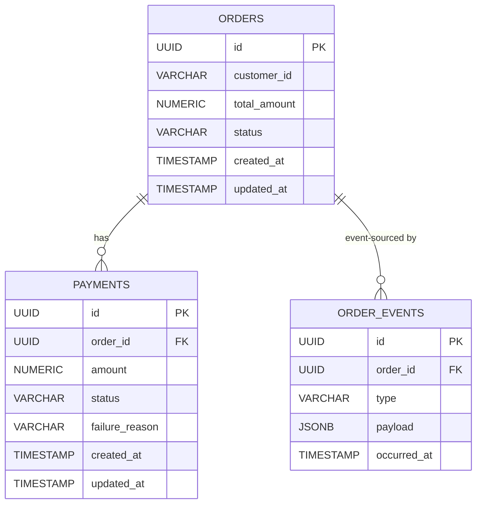

```mermaid
erDiagram
    ORDERS {
        UUID id PK
        VARCHAR customer_id
        NUMERIC total_amount
        VARCHAR status
        TIMESTAMP created_at
        TIMESTAMP updated_at
    }

    PAYMENTS {
        UUID id PK
        UUID order_id FK
        NUMERIC amount
        VARCHAR status
        VARCHAR failure_reason
        TIMESTAMP created_at
        TIMESTAMP updated_at
    }

    ORDER_EVENTS {
        UUID id PK
        UUID order_id FK
        VARCHAR type
        JSONB payload
        TIMESTAMP occurred_at
    }

    ORDERS ||--o{ PAYMENTS : "has"
    ORDERS ||--o{ ORDER_EVENTS : "event-sourced by"
```