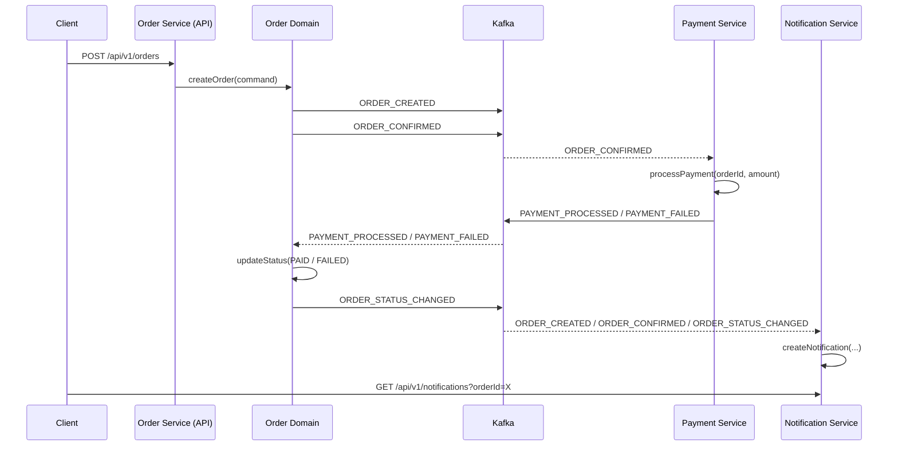

```mermaid
sequenceDiagram
    participant Client
    participant OrderAPI as Order Service (API)
    participant OrderDomain as Order Domain
    participant Kafka as Kafka
    participant Payment as Payment Service
    participant Notification as Notification Service

    Client->>OrderAPI: POST /api/v1/orders
    OrderAPI->>OrderDomain: createOrder(command)
    OrderDomain->>Kafka: ORDER_CREATED
    OrderDomain->>Kafka: ORDER_CONFIRMED

    Kafka-->>Payment: ORDER_CONFIRMED
    Payment->>Payment: processPayment(orderId, amount)
    Payment->>Kafka: PAYMENT_PROCESSED / PAYMENT_FAILED

    Kafka-->>OrderDomain: PAYMENT_PROCESSED / PAYMENT_FAILED
    OrderDomain->>OrderDomain: updateStatus(PAID / FAILED)
    OrderDomain->>Kafka: ORDER_STATUS_CHANGED

    Kafka-->>Notification: ORDER_CREATED / ORDER_CONFIRMED / ORDER_STATUS_CHANGED
    Notification->>Notification: createNotification(...)
    Client->>Notification: GET /api/v1/notifications?orderId=X
```