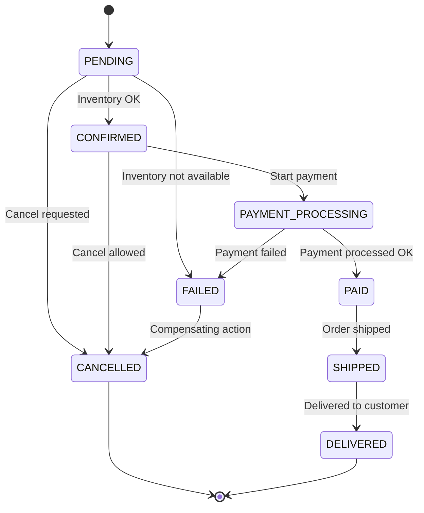

```mermaid
stateDiagram-v2
    [*] --> PENDING

    PENDING --> CONFIRMED: Inventory OK
    PENDING --> FAILED: Inventory not available
    PENDING --> CANCELLED: Cancel requested

    CONFIRMED --> PAYMENT_PROCESSING: Start payment
    PAYMENT_PROCESSING --> PAID: Payment processed OK
    PAYMENT_PROCESSING --> FAILED: Payment failed
    CONFIRMED --> CANCELLED: Cancel allowed

    PAID --> SHIPPED: Order shipped
    SHIPPED --> DELIVERED: Delivered to customer

    FAILED --> CANCELLED: Compensating action
    CANCELLED --> [*]
    DELIVERED --> [*]
```